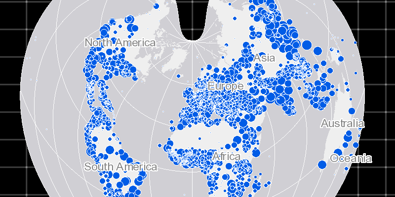

<h1>Map Spatial Reference</h1>

Demonstrates how you can set the spatial reference on a ArcGISMap and all the operational layers will project accordingly.

<h2>How to use the sample</h2>

ArcGISMapImageLayer is added to map with default spatial reference of GCS<em>WGS</em>1984 (WKID: 4326). By setting the ArcGISMap to a spatial reference of world bonne (WKID: 54024), the ArcGISMapImageLayer gets re-projected to map's spatial reference.

<h2>How it works</h2>

To set a <code>SpatialReference</code> and project that to all operational layers of <code>ArcGISMap</code>:

<ol>
  <li>Create an ArcGIS map passing in a spatial reference, <code>ArcGISMap(SpatialReference.create(54024))</code>.  </li>
  <li>Create an <code>ArcGISMapImageLayer</code> as a <code>Basemap</code>.</li>
  <li>Set basemap to ArcGIS map.</li>
  <li>Set ArcGIS map to the <code>MapView</code>.
    <ul><li>the ArcGIS map image layer will now use the spatial reference set to the map and not it's default spatial reference</li></ul></li>
</ol>

<h2>Features</h2>

<ul>
  <li>ArcGISMap</li>
  <li>ArcGISMapImageLayer</li>
  <li>Basemap</li>
  <li>MapView</li>
  <li>SpatialReference</li>
</ul>

