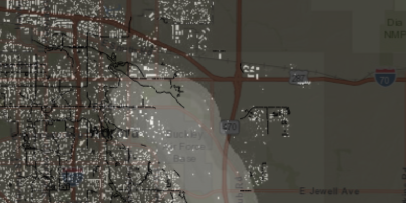

<h1>Read GeoPackage</h1>

Demonstrates how to read rasters and feature tables from geoPackages to show them as layers in a map.

<h2>How to use the sample</h2>

The layers in the geoPackage, which have not been added to the map are shown in the bottom list. Click an item to 
show it as a layer in the map. Layers in the map are listed in the top list. Click layers from the top list to 
remove them from the map.

<h2>How it works</h2>

To read layers from a geoPackage and show them in a map:

<ol>
    <li>Create a <code>GeoPackage</code> with the path to the local geoPackage file.</li>
    <li>Load the <code>GeoPackage</code> with <code>GeoPackage.loadAsync</code>.</li>
    <li>Create raster layers for each of these with <code>new RasterLayer(geoPackageRaster)</code>.</li>
        <li>Add each layer to the map as an operational layer with <code>map.getOperationalLayers().add(layer)</code>.</li>
    <li>When it's done loading, get the <code>GeoPackageFeatureTable</code>s inside with <code>geoPackage
    .getGeoPackageFeatureTables()</code>.</li>
    <li>For each feature table, create a feature layer with <code>new FeatureLayer(featureTable)</code>.</li>
    <li>You can also get the <code>GeoPackageRaster</code>s inside using <code>GeoPackage.getGeoPackageRasters()</code>.</li>
</ol>

<h2>Features</h2>

<ul>
<li>ArcGISMap</li>
<li>Basemap</li>
<li>FeatureLayer</li>
<li>GeoPackage</li>
<li>GeoPackageFeatureTable</li>
<li>GeoPackageRaster</li>
<li>Layer</li>
<li>MapView</li>
<li>RasterLayer</li>
</ul>
