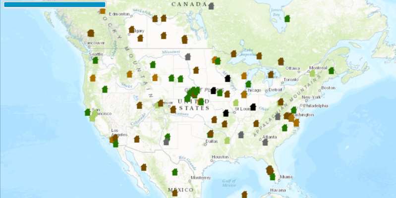

<h1>Display Drawing Status</h1>

Demonstrates how to display the current DrawStatus of the MapView.

<h2>How to use the sample</h2>

The progress bar in the top right displays the drawing status of the map view.

<h2>How it works</h2>

To use the <code>MapView</code>'s <code>DrawStatus</code>:

<ol>
    <li>Create an <code>ArcGISMap</code>. </li>
    <li>Set the map to the view <code>MapView</code>, <code>MapView.setMap()</code>. </li>
    <li>Add <code>MapView.addDrawStatusChangedListener()</code> block and listen when the <code>MapView.DrawStatus</code> changes.</li>
</ol>

<h2>Features</h2>

<ul>
    <li>ArcGISMap</li>
    <li>Basemap</li>
    <li>DrawStatus </li>
    <li>DrawStatusChangedEvent</li>
    <li>Envelope</li>
    <li>FeatureLayer</li>
    <li>MapView</li>
    <li>Point</li>
</ul>
