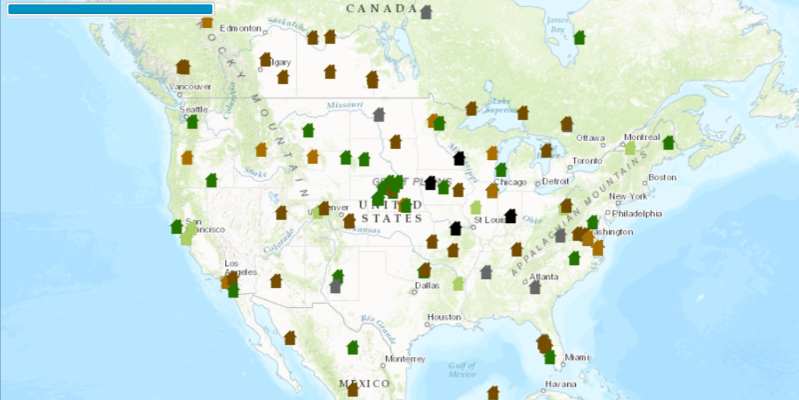

#Display Drawing Status#
Demonstrates how to display the current DrawStatus of the MapView.

##How to use the sample##
The progress bar in the top right displays the drawing status of the map view.

##How it works##
To use the `MapView`'s `DrawStatus`:

1. Create an `ArcGISMap`. 
2. Set the map to the view `MapView`, `MapView.setMap()`. 
3. Add `MapView.addDrawStatusChangedListener()` block and listen when the `MapView.DrawStatus` changes.

##Features
- ArcGISMap
- Basemap
- DrawStatus 
- DrawStatusChangedEvent
- Envelope
- FeatureLayer
- MapView
- Point
