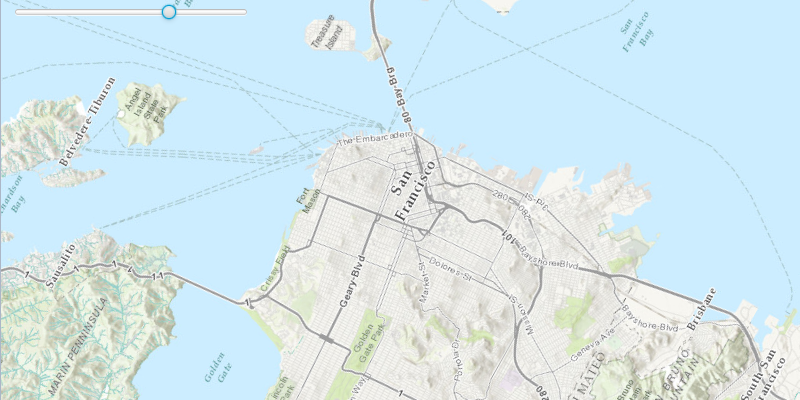

<h1>Map Rotation</h1>

Demonstrates how to rotate a map.

<h2>How to use the sample</h2>

Use the slider to rotate the map. If the map is not pointed north, the compass will display the current heading. 
Click the compass to set the map's heading to north.

<h2>How it works</h2>

To rotate a map:

<ol>
    <li>Create an <code>ArcGISMap</code>.</li>
    <li>Add the map to a <code>MapView</code>.</li>
    <li>Use <code>MapView.setViewpointRotationAsync</code> to indicate the rotation angle.</li>
</ol>

<h2>Features</h2>

<ul>
    <li>ArcGISMap</li>
    <li>Compass</li>
    <li>Envelope</li>
    <li>MapView</li>
    <li>Point</li>
</ul>
