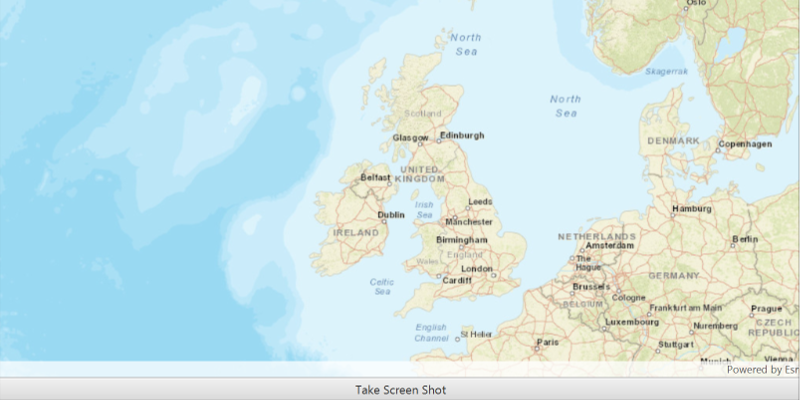

<h1>Take Screen Shot (MapView)</h1>

Demonstrates how to export a section of the ArcGISMap as an image file.

<h2>How to use this Sample</h2>

Take Screen Shot Button

<ul>
    <li>Takes a screen shot of the current view and display in a dialog box.</li>
</ul>

Dialog Box

<ul>
    <li>Save Button: Save image as `MapViewScreenShot.png` in same folder as TakeScreenShot.java</li>
    <li>Cancel Button: exits dialog and goes back to MapView.</li>
</ul>

<h2>How it works</h2>

To export a section of the <code>ArcGISMap</code> as an image file:

<ol>
    <li>To export an image from the <code>MapView</code>, <code>MapView.exportImageAsync()</code></li>
    <li>Listen for image to be done exporting, <code>ListenableFuture.addDoneListener(Runnable)</code></li>
    <li>Get Image from listener, <code>ListenableFuture.get()</code></li>
</ol>

<h2>Features</h2>

<ul>
    <li>ArcGISMap</li>
    <li>MapView</li>
</ul>

