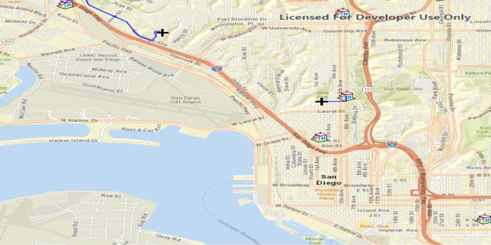

<h1>Closest Facility</h1>

Demonstrates how to solve a Closest Facility Task to find the closest route between a facility, hospital, and a incident, black cross.

<h2>How to use sample</h2>

Left click near any of the hospitals and a route will be displayed from that clicked location to the nearest hospital.

<h2>How it works</h2>

To display a <code>ClosestFacilityRoute</code> between an <code>Incident</code> and a <code>Facility</code>:

<ol>
    <li>Create a <code>ClosestFacilityTask</code> using  an Url from an online service.</li>
    <li>Get <code>ClosestFacilityParameters</code> from task, <code>task.createDefaultParametersAsync().get()</code></li>
    <li>Add incicdent to parameters, <code>facilityParameters.getFacilities().addAll(facilities)</code>.</li>
    <li>Add facilities to parameters, <code>facilityParameters.getIncidents().add(new Incident(incidentPoint))</code>.</li>
    <li>Get <code>ClosestFacilityResult</code> from solving task with parameters, <code>task.solveClosestFacilityAsync(facilityParameters).get()</code></li>
    <li>Get index list of closet facilities to incident, <code>facilityResult.getRankedFacilities(0)</code></li>
    <li>Get index of closest facility, <code>rankedFacilitiesList.get(0)</code></li>
    <li>Find closest facility route, <code>facilityResult.getRoute(closestFacilityIndex, IncidentIndex)</code></li>
    <li>Display route to <code>MapView</code>. 
      <ul>Create <code>Graphic</code> from route geometry, <code>new Graphic(route.getRouteGeometry())</code></ul>
      <ul>Add graphic to <code>GraphicsOverlay</code> which is attached to the mapview</ul></li>
</ol>

<h2>Features</h2>

<ul>
  <li>ClosestFacilityParameters</li>
  <li>ClosestFacilityResult</li>
  <li>ClosestFacilityRoute</li>
  <li>ClosestFacilityTask</li>
  <li>Facility</li>
  <li>Graphic</li>
  <li>GraphicsOverlay</li>
  <li>Incident</li>
  <li>MapView</li>
</ul>

