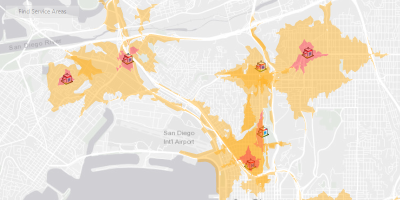

<h1>Find service areas for multiple facilities</h1>

Find the service areas of several facilities from a feature service.

<h2>Use case</h2>

A service area is a region which can be accessed from a facility as limited by one or more factors, such as travel time, distance, or cost. When analyzing the service area of multiple facilities, this workflow can be used to identify gaps in service area coverage, or significant overlaps, helping to optimize the distribution of facilities. For example, a city's health service may identify areas of a city that can be served effectively from particular hospitals, and with this optimize distribution of staff and resources.

<h2>How to use the sample</h2>

Click 'find service areas' to calculate and display the service area of each facility on the map. The polygons displayed around each facility represents the service area; in red is the area that is within 3 minutes away from the hospital by car. Light orange is the area that is within 5 minutes away from the hospital by car. All polygons have transparency to them, so that when service areas from multiple facilities overlap, these areas will appear in bolder colors.

<h2>How it works</h2>

<ol>
  <li>Create a new <code>ServiceAreaTask</code> from a network service.</li>
  <li>Create default <code>ServiceAreaParameters</code> from the service area task.</li>
  <li>Set the parameters <code>ServiceAreaParameters.setReturnPolygons(true)</code> to return polygons of all service areas.</li>
  <li>Add facilities of the <code>ServiceAreaParameters</code>. For this, use a set of <code>QueryParameters</code> to select features from a <code>ServiceFeatureTable</code>: <code>serviceAreaParameters.SetFacilities(facilitiesTable, queryParameters)</code>.</li>
  <li>Get the <code>ServiceAreaResult</code> by solving the service area task using the parameters.</li>
  <li>For each facility, get any <code>ServiceAreaPolygons</code> that were returned, <code>serviceAreaResult.getResultPolygons(facilityIndex)</code>.</li>
  <li>Display the service area polygons as <code>Graphics</code> in a <code>GraphicsOverlay</code> on the <code>MapView</code>.</li>
</ol>

<h2>About the data</h2>

This sample uses a street map of San Diego, in combination with a feature service with facilities (used here to represent hospitals). Additionally a street network is used on the server for calculating the service area.

<h2>Relevant API</h2>

<ul>
  <li>ServiceAreaParameters</li>
  <li>ServiceAreaPolygon</li>
  <li>ServiceAreaResult</li>
  <li>ServiceAreaTask</li>
</ul>

<h2 id="tags">Tags</h2>

feature service, impedance, network analysis, travel time
