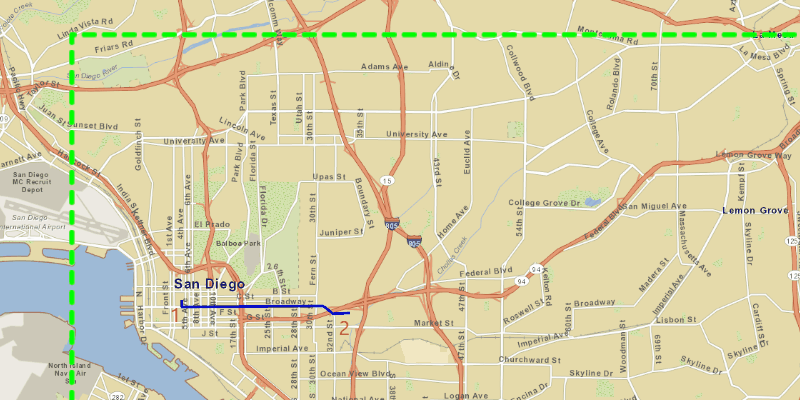

<h1>Offline Routing</h1>

Demonstrates how to solve a route on-the-fly using only offline data.

<h2>How to use the sample</h2>

Left-click near a road to add a stop to the route. A number graphic will show its order in the route. After 
adding at least 2 stops, a route will display. Use the combo box in the top left corner to choose between the travel 
modes "Fastest" and "Shortest" (how the route is optimized). To move a stop, right-click the graphic to select it, 
then move your mouse to reposition, and finally right-click again to set the new position. The route will update 
on-the-fly while moving stops. The green box marks the boundary of the route geodatabase.

<h2>How it works</h2>

To display a <code>Route</code> using a <code>RouteTask</code> with offline data:

<ol>
  <li>Create the map's <code>Basemap</code> from a local tile package using a <code>TileCache</code> and <code>ArcGISTiledLayer</code></li>
  <li>Create a <code>RouteTask</code> with an offline locator geodatabase</li>
  <li>Get the <code>RouteParameters</code> using <code>routeTask.createDefaultParameters()</code></li>
  <li>Create <code>Stop</code>s and add them to the route task's parameters.</li>
  <li>Solve the <code>Route</code> using <code>routeTask.solveRouteAsync(routeParameters)</code></li>
  <li>Create a graphic with the route's geometry and a <code>SimpleLineSymbol</code> and display it on another 
  <code>GraphicsOverlay</code>.</li>
</ol>

<h2>Relevant API</h2>

<ul>
  <li>ArcGISMap</li>
  <li>ArcGISTiledLayer</li>
  <li>Graphic</li>
  <li>GraphicsOverlay</li>
  <li>MapView</li>
  <li>Route</li>
  <li>RouteTask</li>
  <li>RouteParameters</li>
  <li>RouteResult</li>
  <li>SimpleLineSymbol</li>
  <li>Stop</li>
  <li>TextSymbol</li>
  <li>TileCache</li>
</ul>
