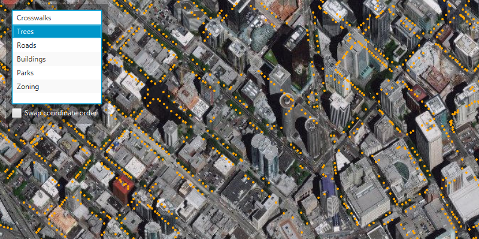

<h1>Browse WFS layers</h1>

Browse a WFS service for layers and add them to the map.

<h2>Use case</h2>

Services often have multiple layers available for display. For example, a feature service for a city might have layers representing roads, land masses, building footprints, parks, and facilities. A user can choose to only show the road network and parks for a park accessibility analysis. 

<h2>How to use the sample</h2>

A list of layers in the WFS service will be shown. Select a layer and then click the "Load selected layer" button to display it.

Some WFS services return coordinates in X,Y order, while others return coordinates in lat/long (Y,X) order. If you don't see features rendered or you see features in the wrong location, use the checkbox to swap the coordinate order and reload.

<h2>How it works</h2>

<ol>
<li>Create a <code>WfsService</code> object with a URL to a WFS feature service.</li>

<li>Obtain a list of <code>WfsLayerInfo</code> from the WFS service with <code>getServiceInfo().getLayerInfos()</code>.</li>

<li>Create a <code>WfsFeatureTable</code> from the <code>WfsLayerInfo</code>.

<ul>
<li>Set the axis order of the table if necessary.</li></ul>
</li>

<li>Create a <code>FeatureLayer</code> from the WSF feature table.</li>

<li>Add the feature layer to the map.

<ul>
<li>The sample uses randomly-generated symbology, similar to the behavior in ArcGIS Pro.</li></ul>
</li>
</ol>

<h2>Relevant API</h2>

<ul>
<li>WfsService</li>

<li>WfsServiceInfo</li>

<li>WfsLayerInfo</li>

<li>WfsFeatureTable</li>

<li>FeatureLayer</li>

<li>WfsFeatureTable.AxisOrder</li>
</ul>

<h2>About the data</h2>

This service shows features for downtown Seattle. For additional information, see the underlying service on <a href="https://arcgisruntime.maps.arcgis.com/home/item.html?id=1b81d35c5b0942678140efc29bc25391">ArcGIS Online</a>.

<h2>Tags</h2>

OGC, WFS, feature, web, service, layers, browse, catalog
