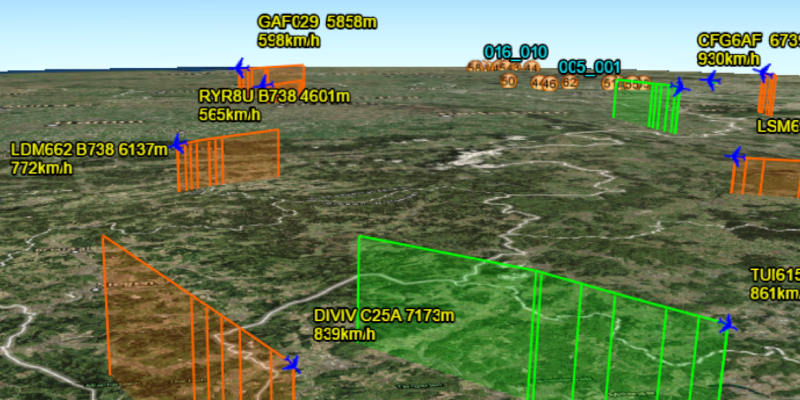

<h1>Display KML Network Links</h1>

Display KML with a network link and show network messages as the data is automatically refreshed.

<h2>How to use the sample</h2>

The data shown should refresh automatically every few seconds. Network messages will be displayed in the list view as they come in.

<h2>How it works</h2>

To show KML with network links and display network messages:

<ol>
    <li>Create a <code>KmlNetworkDataset</code> from a KML source which has network links.</li>
    <li>Construct a <code>KmlLayer</code> with the dataset and add the layer as an operational layer.</li>
    <li>To listen for network messages, add a <code>KmlNetworkLinkMessageReceivedListener</code> on the dataset.</li>
</ol>

<h2>Relevant API</h2>

<ul>
<li>KmlDataset</li>
<li>KmlLayer</li>
<li>KmlNetworkLinkMessageReceivedEvent</li>
</ul>

<h2>About the data</h2>

This map shows the current air traffic in parts of Europe with heading, altitude, and ground speed. Additionally, noise levels from ground monitoring stations are shown.

<h2>Tags</h2>

KML, KMZ, OGC, Keyhole, Network Link, Network Link Control
