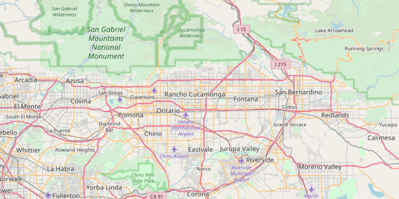

<h1>OpenStreetMap Layer</h1>

Add the OpenStreetMap layer to a map as a Basemap.

<figcaption>OpenStreetMap Layer App</figcaption>
</figure>

<h2>How to use the sample</h2>

Simply run the app.

<h2>How it works</h2>

Instantiate an <code>ArcGISMap</code> with a <code>Basemap.Type.OPEN_STREET_MAP</code> and add it to a <code>MapView</code>. The attribution text that is required by OpenStreetMap is automatically added to the <code>MapView's</code> attributionText without any additional code.

<h2>Relevant API</h2>

<ul>
   <li>ArcGISMap</li>
   <li>Basemap</li>
   <li>MapView</li>
</ul>

<h4>Tags</h4>

Layers

