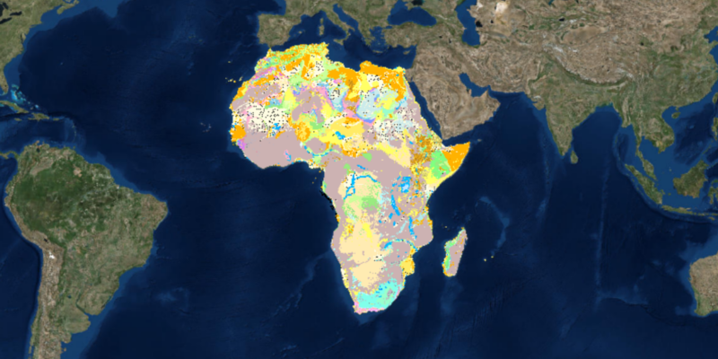

<h1>WMS Layer URL</h1>

Shows how to display a WMS layer from a URL.

<h2>How it works</h2>

To create a <code>WmsLayer</code> from a URL and display it:

<ol>
  <li>Create a <code>WmsLayer</code> specifying the URL of the service and the layer names you want <code>new 
  WmsLayer(url, names)</code>.</li>
  <li>To display it, add it to the map as an operational layer <code>map.getOperationalLayers().add(wmsLayer)</code>.</li>
</ol>

<h2>Relevant API</h2>

<ul>
  <li>ArcGISMap</li>
  <li>MapView</li>
  <li>WmsLayer</li>
</ul>
