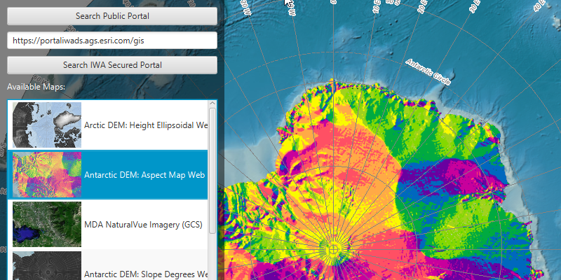

# Integrated windows authentication

Use Windows credentials to access services hosted on a portal secured with Integrated Windows Authentication (IWA).

## Use case

Integrated Windows Authentication, which is built into Microsoft Internet Information Server (IIS), works well for intranet applications, but isn't always practical for internet apps.

## How to use the sample

1. Enter the URL to your IWA-secured portal into the text field.
2. Select either the `Search Public Portal` button (which will search for portals on www.arcgis.com) or `Search IWA Secured Portal` (which will search your IWA-secured portal), to search for web maps stored on the portal.
3. If you chose to search a secured portal, you will be prompted for a username (including domain, such as username@DOMAIN or domain\username), and password.
4. If you authenticate successfully, portal item results will display in the list.
5. Select a web map item to display it in the map view.

## How it works

1. The `AuthenticationManager` object is configured with a challenge handler that will prompt for a Windows login (username@domain and password) if a secure resource is encountered.
2. When a search for portal items is performed against an IWA-secured portal, the challenge handler creates a `UserCredential` object from the information entered by the user.
3. If the user authenticates, the search returns a list of web maps (`ArcGISPortalItem`) and the user can select one to display as a `Map`.

## Relevant API

* `AuthenticationChallenge`
* `AuthenticationChallengeResponse`
* `AuthenticationManager`
* `AuthenticationManager.setAuthenticationChallengeHandler`
* `Portal`
* `UserCredential`

## About the data

This sample searches for web map portal items on a secure portal. To successfully run the sample, you need:
 * Access to a portal secured with Integrated Windows Authentication that contains one or more web map items.
 * A login that grants you access to the portal.
 
## Additional Information
 
 More information about IWA and it's use with ArcGIS can be found at the following links:
  - [Use Integrated Windows Authentication with your portal](http://enterprise.arcgis.com/en/portal/latest/administer/windows/use-integrated-windows-authentication-with-your-portal.htm)
  - [IWA - Wikipedia](https://en.wikipedia.org/wiki/Integrated_Windows_Authentication)
  
## Tags

Authentication, Security, Windows, Portal
