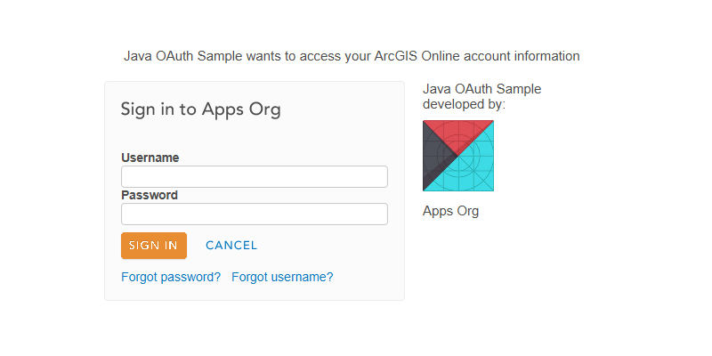

<h1>OAuth</h1>

Demonstrates how to use the OAuth 2.0 protocol for authentication into the ArcGIS platform. Once authenticated the sample displays the user's profile.

<h2>How to use the sample</h2>

Enter the details of the application registered in ArcGIS platform. Click on sign-in.
This will allow the ArcGIS platform to prompt a sign-in dialog. After the credentials are entered correctly, the sample
will receive an authorization code from the ArcGIS platform. This authorization code will then be used to obtain an
access token. This access token is used later to access user's profile.

<h2>How it works</h2>

<ol>
    <li>Setup an <code>OAuthConfiguration</code> with the settings of an application registered in the ArcGIS platform.</li>
    <li>Setup an <code>AuthenticationChallengeHandler</code> that challenges the user for authentication. You could
    create a custom handler similar to the one created in this sample <code>OAuthChallengeHandler</code>.</li>
    <li>On trying to access a secured resource, the authentication challenge in invoked.</li>
    <li><code>OAuthChallengeHandler</code> directs the user to a sign-in page (using a <code>WebView</code>) from ArcGIS platform.</li>
    <li>On successful sign-in, the ArcGIS platform provides an authorization code.</li>
    <li>Use the authorization code, to create a <code>OAuthTokenCredentialRequest</code>. This will be used by the Runtime
    to request an access token. The access token is then used to request a secured resource in the ArcGIS platform.</li>
</ol>

<h2>Features</h2>

<ul>
    <li>OAuthConfiguration</li>
    <li>AuthenticationChallengeHandler</li>
    <li>OAuthTokenCredentialRequest</li>
</ul>
