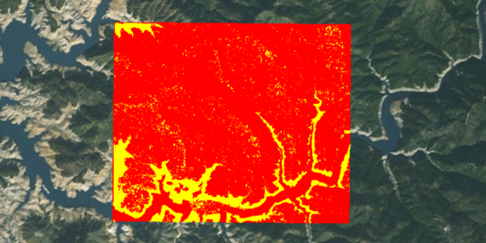

# Colormap Renderer

Apply a colormap renderer to a raster.

Colormap renderers can be used to replace values on a raster layer with
a color based on the original value brightness.

## How it works

To apply a `ColormapRenderer` to a `RasterLayer`:

1.  Create a `Raster` from a raster file
2.  Create a `RasterLayer` from the raster
3.  Create a `List<Integer>` representing colors. Colors at the
    beginning of the list replace the darkest values in the raster and
    colors at the end of the list replaced the brightest values of the
    raster.
4.  Create a `ColormapRenderer` with the color list and apply it to the
    raster layer with `rasterLayer.setRasterRenderer(colormapRenderer)`
