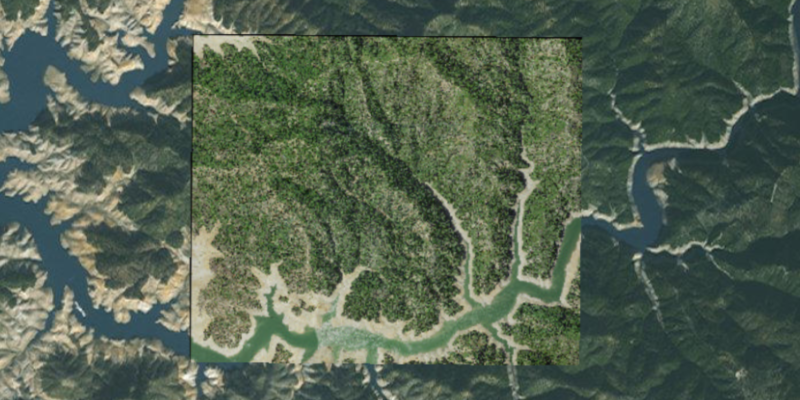

<h1>Raster Layer File</h1>

How to create and use a raster layer made from a local raster file.

<h2>How it works</h2>

To add a `RasterLayer` as an operational layer from a local raster file:

<ol>
  <li>Create a `Raster` from a raster file</li>
  <li>Create a `RasterLayer` from the raster</li>
  <li>Add it as an operational layer with `map.getOperationalLayers().add(rasterLayer)</li>
</ol>

<h2>Features</h2>

<ul>
  <li>ArcGISMap</li>
  <li>Basemap</li>
  <li>MapView</li>
  <li>Raster</li>
  <li>RasterLayer</li>
</ul>