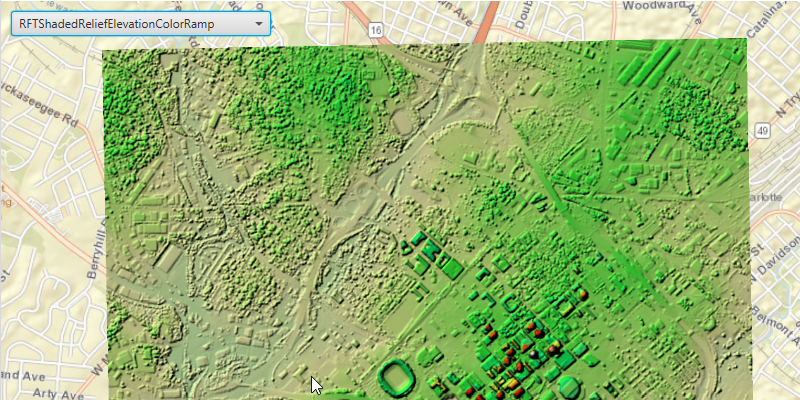

<h1 id="rasterrenderingrule">Raster Rendering Rule</h1>

Create an <code>ImageServiceRaster</code>, fetch the <code>RenderingRules</code> from the service info, and use a <code>RenderingRule</code> to create an <code>ImageServiceRaster</code> and add it to a raster layer. 

<h2 id="howtousethesample">How to use the sample</h2>

Run the sample and use the drop-down menu at the top to select a rendering rule.

<h2 id="howitworks">How it works</h2>

When the sample starts, an <code>ImageServiceRaster</code> is created and added to a <code>RasterLayer</code>. The <code>RasterLayer</code> is then added to the map as an operational layer. Connect to the <code>loadStatusChanged</code> signal for the <code>ImageServiceRaster</code>. Once the <code>ImageServiceRaster</code> is loaded, the <code>RenderingRuleInfos</code> are fetched. Iterate over each item in the RenderingRuleInfos to get the rendering rule name and populate <code>List</code> using the names. This becomes the list for the <code>ComboBox</code>. When an item from the ComboBox is selected, the <code>RenderingRuleInfo</code> for the selected index is fetched from the service info. A <code>RenderingRule</code> object is created using the <code>RenderingRuleInfo</code> and applied to a newly created <code>ImageServiceRaster</code>. The <code>ImageServiceRaster</code> is then added to the <code>RasterLayer</code>.  

<h2 id="relevantapi">Relevant API</h2>

<ul>
<li>ImageServiceRaster</li>

<li>RenderingRule</li>

<li>RasterLayer</li>
</ul>

<h4 id="tags">Tags</h4>

Visualization
