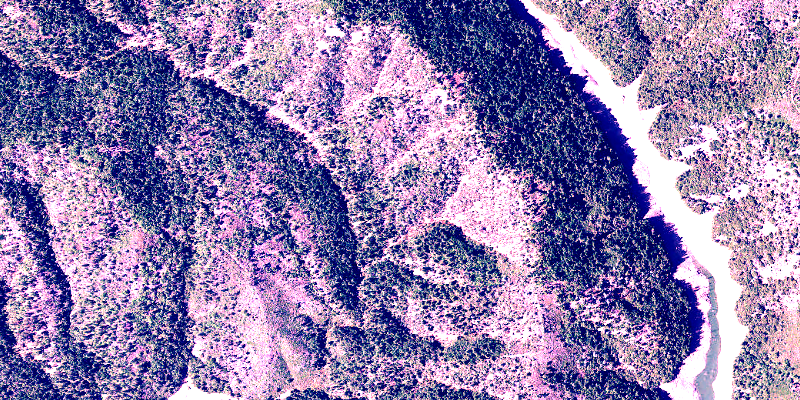

<h1>Rgb Renderer</h1>

How to use a RGB renderer on a raster layer. An RGB renderer is used to adjust the color bands of a multispectral 
image.

<h2>How to use the sample</h2>

Choose one of the stretch parameter types. The other options will adjust based on the chosen type.

<h2>How it works</h2>

To apply a `RgbRenderer` to a `RasterLayer`:

<ol>
  <li>Create a `Raster` from a multispectral raster file</li>
  <li>Create a `RasterLayer` from the raster</li>
  <li>Create a `Basemap` from the raster layer and set it to the map</li>
  <li>Create a `RgbRenderer`, specifying the stretch parameters and other properties</li>
  <li>Set the renderer on the raster layer with `rasterLayer.setRenderer(renderer)`</li>
</ol>

<h2>Features</h2>

<ul>
  <li>ArcGISMap</li>
  <li>Basemap</li>
  <li>MapView</li>
  <li>Raster</li>
  <li>RasterLayer</li>
  <li>RgbRenderer</li>
  <li>StretchParameters</li>
</ul>