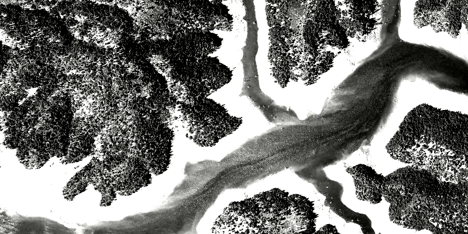

<h1>Stretch Renderer</h1>

How to use a stretch renderer on a raster layer. A stretch renderer can be used to stretch tightly grouped values 
across the available value spectrum, creating more contrast between objects. This is useful for identifying objects 
in dark images.

<h2>How to use the sample</h2>

Choose one of the stretch parameter types. The other options will adjust based on the chosen type.

<h2>How it works</h2>

To apply a <code>StretchRenderer</code> to a <code>RasterLayer</code>:

<ol>
  <li>Create a <code>Raster</code> from a raster file</li>
  <li>Create a <code>RasterLayer</code> from the raster</li>
  <li>Create a <code>Basemap</code> from the raster layer and set it to the map</li>
  <li>Create a <code>StretchRenderer</code>, specifying the stretch parameters and other properties</li>
  <li>Set the renderer on the raster layer with <code>rasterLayer.setRenderer(renderer)</code></li>
</ol>

<h2>Features</h2>

<ul>
  <li>ArcGISMap</li>
  <li>Basemap</li>
  <li>MapView</li>
  <li>Raster</li>
  <li>RasterLayer</li>
  <li>StretchParameters</li>
  <li>StretchRenderer</li>
</ul>
