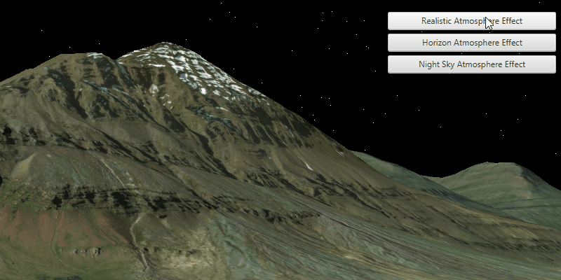

<h1>Change Atmosphere</h1>

Changes the visual appearance of the atmosphere in a 3D map (scene).

<h2>How to use the sample</h2>

Select one of the three available atmosphere effects. The atmosphere will change to display the selected atmosphere effect. 

<h2>How it works</h2>

To change the atmosphere effect:

<ol>
<li>Create an <code>ArcGISScene</code> and display it in a <code>SceneView</code>.</li>

<li>Change the atmosphere effect with <code>SceneView.setAtmosphereEffect()</code>.</li>
</ol>

<h2>Relevant API</h2>

<ul>
<li><code>ArcGISScene</code></li>

<li><code>SceneView</code></li>

<li><code>AtmosphereEffect</code></li>
</ul>

<h2>Tags</h2>

3D, Scene, AtmosphereEffect. 
