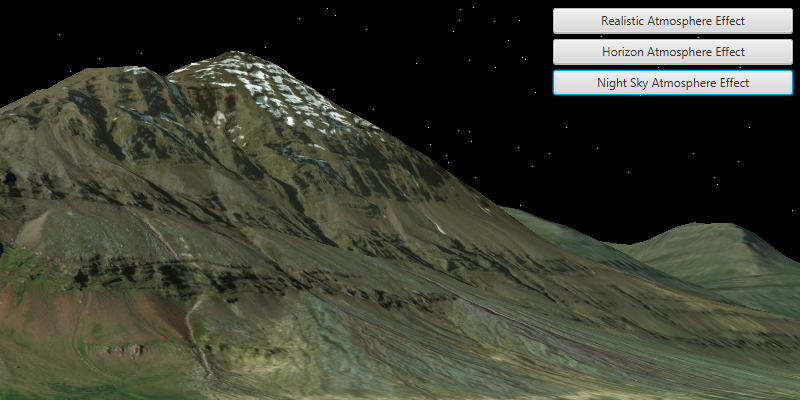

# Change Atmosphere

Changes the visual appearance of the atmosphere in a 3D map (scene).

## How to use the sample

Select one of the three available atmosphere effects. The atmosphere will change to display the selected atmosphere effect. 

## How it works

To change the atmosphere effect:

1. Create an `ArcGISScene` and display it in a `SceneView`.
2. Change the atmosphere effect with <code>SceneView.setAtmosphereEffect()</code>.
 
## Relevant API
- `ArcGISScene`
- `SceneView`
- `AtmosphereEffect`

## Tags

3D, Scene, AtmosphereEffect. 
