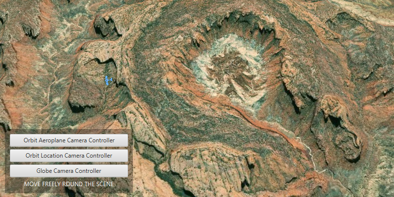

<h1>Choose camera controller</h1>

Use a <code>GlobeCameraController</code> or an <code>OrbitGeoElementCameraController</code> to view the scene.

<h2>Use case</h2>

The globe camera controller allows a user to explore the scene fully. However, when a user wishes to fix the camera on a particular graphic (stationary or mobile) in the scene, an orbit camera controller is appropriate. This allows visualization of that graphic in 3D from all angles, and of any data or analysis spatially related to it. 

<h2>How to use the sample</h2>

 The application loads with an orbit camera controller set to the 3D graphic (i.e. the map will rotate and centre on it). To navigate freely away from the graphic, exit orbit mode by hitting the "Globe Camera Controller" button (i.e. camera will no longer be fixed to the graphic). Hit the "Orbit Camera Controller" button to return the camera back onto the graphic.
                                   

<h2>How it works</h2>

<ol>
  <li>Instantiate an <code>ArcGISScene</code> object and set a <code>Basemap</code> object to it with <code>ArcGISScene.setBasemap()</code>.</li>
  <li>Instantiate a <code>SceneView</code> object and set a new <code>ArcGISScene</code> object to it with <code>sceneView.setScene(scene)</code>.</li>
  <li>Instantiate an <code>OrbitGeoElementCameraController</code> object, with  a <code>GeoElement</code> object (in this case a <code>Graphic</code>) and camera distance as parameters. </li>
  <li>Use <code>sceneView.setCameraController(OrbitCameraController)</code> to set the camera to the scene view.</li> 
  <li>To navigate freely across the <code>Scene</code>, instantiate a <code>GlobeCameraController</code> and set it to the scene view. </li>
</ol>

<h2>Relevant API</h2>

<ul>
  <li>3D</li>
  <li>ArcGISScene</li>
  <li>Camera</li>
  <li>GlobeCameraController</li>
  <li>OrbitGeoElementCameraController</li>
  <li>SceneView</li>
</ul>

<h2>Tags</h2>

OrbitGeoElementCameraController, GlobeCameraController, Camera, SceneView, 3D

