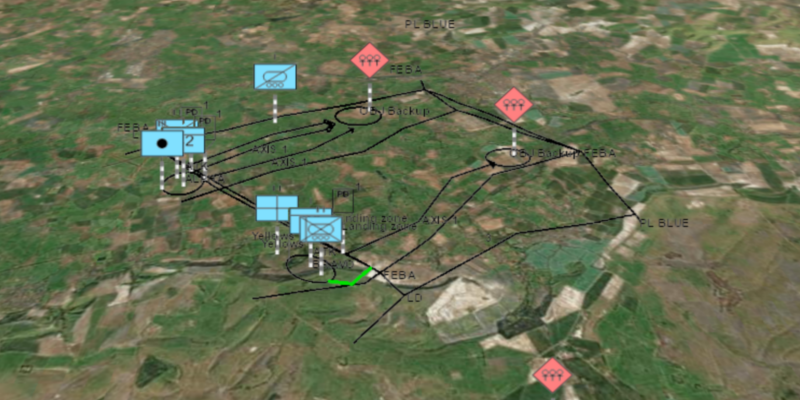

<h1>Dictionary Renderer with Graphics Overlay 3d</h1>

Demonstrates how to apply a dictionary renderer to a graphics overlay and display mil2525d graphics in 3D.
  The dictionary renderer creates these graphics using a local mil2525d style file and a XML file with key,
  value attributes for each graphic.

<h2>How it works</h2>

To apply a <code>DictionaryRenderer</code> and display mil2525d graphics:

<ol>
  <li>Create a <code>SymbolDicitonary</code>, <code>SymbolDictionary(specificationType, dictionaryPath)</code>.
    <ul><li>specificationType, this will be the mil2525d.stylx local file</li>
      <li>dictionaryPath,  path to the mil2525d.stylx local file</li></ul></li>
  <li>Load the dictionary asynchronously, <code>DictionarySymbol.loadAsync()</code>.
    <ul><li>this will allows the application to continue working while the dictionary loads all symbol primitives found within the mil2525d specification</li></ul></li>
  <li>Create a <code>DictionaryRenderer</code>, <code>DictionaryRenderer(SymbolDictionary)</code>.
    <ul><li>apply it to the <code>GraphicsOverlay.setRenderer(DictionaryRenderer)</code></li></ul></li>
  <li>Parse through local XML file creating a mapping of key, value pairs for each block of attributes.
    <ul><li>use the name of the attribute as key and text within that attribute as the value</li></ul></li>
  <li>Create a graphic for each mapping of attributes.
    <ul><li>_wkid key, holds the geometry's spatial reference</li>
      <li><em>control</em>points, creates the shape of the geometry</li>
      <li>other attributes explain to dictionary symbol how to display graphic</li>
      <li>add graphic to <code>GraphicsOverlay.getGraphics().add(Graphic)</code></li></ul></li>
</ol>

<h2>Features</h2>

<ul>
  <li>ArcGISScene</li>
  <li>ArcGISTiledElevationSource</li>
  <li>Basemap</li>
  <li>Camera</li>
  <li>DictionaryRenderer</li>
  <li>Graphic</li>
  <li>GraphicsOverlay</li>
  <li>Point</li>
  <li>PointCollection</li>
  <li>Polygon</li>
  <li>Polyline</li>
  <li>SceneView</li>
  <li>SpatialReference</li>
  <li>Surface</li>
  <li>SymbolDictionary</li>
</ul>

