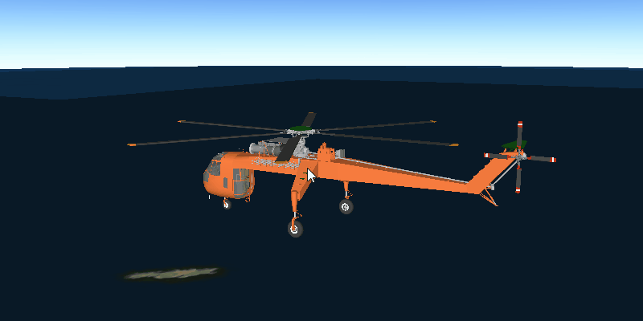

# Distance Composite Symbol

Change a graphic’s symbol based on camera proximity.

Distance composite scene symbols can render different symbols depending
on the distance between the camera and the graphic.

## How to use the sample

The symbol of graphic will change while zooming in or out.

## How it works

To create and display a `DistanceCompositeSceneSymbol`:

1.  Create a `GraphicsOverlay` and add it to the `SceneView`.
2.  Create symbols for each `Range` the composite symbol.
3.  Create a distance composite scene symbol\`.
4.  Add a range for each symbol to
    `DistanceCompositeSceneSymbol.getRangeCollection().add(new
    Range(symbol, min distance, max distance))`.
5.  symbol, symbol to be used within the min/max range that is given
6.  Create a `Graphic` with the symbol: `Graphic(Point,
    DistanceCompositeSceneSymbol)`
7.  Add the graphic to the graphics overlay.
