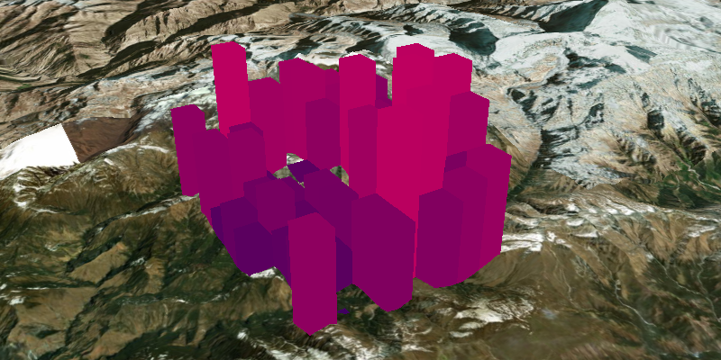

# Extrude Graphics

Extrude graphics based on attributes.

## How to use the sample

Zoom and pan the scene to find the extruded graphics. Note how they are
extruded to the level set in their height property.

## How it works

To extrude graphics according to a property:

1.  Create a `GraphicsOverlay` and `SimpleRenderer`.
2.  Get the renderer’s `SceneProperties` using
    `Renderer.getSceneProperties()`.
3.  Set the extrusion mode for the renderer with
    `SceneProperties.setExtrusionMode(ExtrusionMode)`.
4.  Specify the attribute name of the graphic that the extrusion mode
    will use, `SceneProperties .setExtrusionExpression(“[HEIGHT]”)`.
5.  Set the renderer on the graphics overlay,
    `GraphicsOverlay.setRenderer(Renderer)`.
6.  Create graphics with their attribute set,
    `Graphic.getAttributes().put(“HEIGHT”, Z Value)`.
