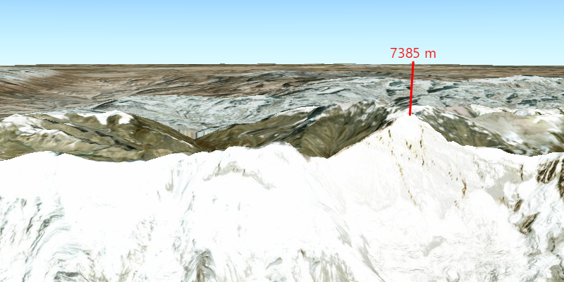

<h1 id="getelevationatapoint">Get elevation at a point</h1>

Get the elevation for a given point on a surface in a scene.

<h2 id="usecase">Use case</h2>

Knowing the elevation at a given point in a landscape can aid in navigation, planning and survey in the field.

<h2 id="howtousethesample">How to use the sample</h2>

Click anywhere on the surface to get the elevation at that point. Elevation is reported in meters since the scene view is in WGS84.

<h2 id="howitworks">How it works</h2>

<ol>
<li>Create a <code>SceneView</code> and <code>Scene</code> with an imagery base map.</li>

<li>Set an <code>ArcGISTiledElevationService</code> as the elevation source of the scene's base surface.</li>

<li>Use the <code>screenToBaseSurface(screenPoint)</code> method on the scene view to convert the tapped screen point into a point on surface.</li>

<li>Use the <code>getElevationAsync(surfacePoint)</code> method on the base surface to asynchronously get the elevation.</li>
</ol>

<h2 id="relevantapi">Relevant API</h2>

<ul>
<li>ArcGISTiledElevationSource</li>

<li>BaseSurface</li>

<li>ElevationSourcesList</li>

<li>SceneView</li>
</ul>

<h2 id="additionalinformation">Additional information</h2>

<code>getElevationAsync(surfacePoint)</code> retrieves the most accurate available elevation value at a given point. To do this, the method must go to the server or local raster file and load the highest level of detail of data for the target location and return the elevation value.

If multiple elevation sources are present in the surface, the top most visible elevation source with a valid elevation in the given location is used to determine the result.

<h4 id="tags">Tags</h4>

MapViews SceneViews and UI, elevation, surface
