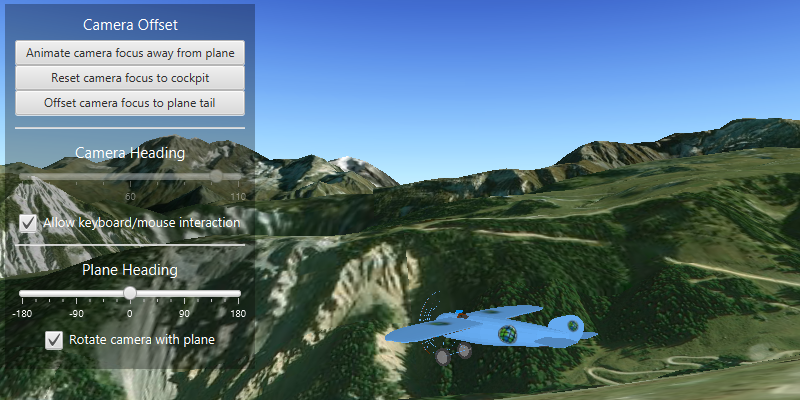

<h1>Orbit the camera around an object</h1>

Use the available controls to navigate around an object within the scene view.

<h2>Use case</h2>

Fixing the camera to a target object, such as a model plane, allows its interactions with the target to be customised by e.g. restricting orientation, distance from target and how the camera mimics the objects orientation. This gives complete control over how the target object is shown and interacted with in a scene view.

<h2>How to use the sample</h2>

 The sample contains two main control panels: one for the plane and one for the camera.
 

For the plane controls (top left control panel):

<ul>
<li>The heading, pitch and roll of the plane can be controlled: adjusting the sliders will update the plane's orientation accordingly.</li>
<li>If the relevant "link camera to plane" checkbox is checked, the camera will follow the plane as its orientation is adjusted. If unchecked it will not, and the camera will remain fixed whilst the plane heading, pitch or roll changes.</li>
</ul>

For the camera controls (lower control panel):

<ul>
<li>The camera's heading, pitch and distance can be changed via a slider, and the minimum and maximum for each set using a spinner (remember to hit enter when changing a value). By setting these the camera will be restricted within the defined limits.</li>
<li>To pan the camera smoothly away from the plane, use the buttons in the 'Gradually travel relative to plane' section, or to jump immediately to a particular distance away from the plane, use the X Y or Z offset spinners below.</li>
<li>The plane's position relative to the screen can be set in the far right control panel, with 0.5 being the default option (the plane will be centred on the screen). 1 will move the plane to the top of the screen and 0 to the bottom.</li>
<li>Finally there are options which will limit the camera navigation to using the control panel only i.e. mouse or keyboard interactions will not adjust the heading, pitch or distance zoom.</li>
</ul>                               

<h2>How it works</h2>

<ol>

  <li>Instantiate an <code>OrbitGeoElementCameraController</code>, with <code>GeoElement</code> and camera distance as parameters.</li>
  <li>Use <code>sceneView.setCameraController(OrbitCameraController)</code> to set the camera to the scene view.</li> 
  <li>Set the heading, pitch and distance camera properties with:
  <ul>
  <li><code>orbitCameraController.setCameraHeadingOffset()</code></li> <li><code>orbitCameraController.setCameraPitchOffset()</code></li> 
  <li><code>orbitCameraController.setCameraDistance()</code></li>
  </ul></li>
  <li>Set the minimum and maximum angle of heading and pitch, and minimum and maximum distance for the camera with:
  <ul>
  <li><code>orbitCameraController.setMin/MaxCameraHeadingOffset()</code></li>
  <li><code>orbitCameraController.setMin/MaxCameraPitchOffset()</code></li>
  <li><code>orbitCameraController.setMin/MaxCameraDistance()</code></li>
  </ul></li>
  <li>Set the distance from which the camera is offset from the plane with:
  <ul>
  <li><code>orbitCameraController.setTargetOffsetsAsync()</code></li>
  <li><code>orbitCameraController.setTargetOffsetX()</code></li>
  <li><code>orbitCameraController.setTargetOffsetY()</code></li>
  <li><code>orbitCameraController.setTargetOffsetZ()</code></li>
  </ul></li>
  <li>Set the vertical screen factor to set where the plane appears in the scene:
  <ul>
  <li><code>orbitCameraController.setTargetVerticalScreenFactor()</code></li>
  </ul></li>
  <li>Set if the camera will interact with zooming or panning using mouse or keyboard (default is true):
  <ul>
  <li><code>orbitCameraController.setCameraHeadingOffsetInteractive()</code></li>
  <li><code>orbitCameraController.setCameraPitchOffsetInteractive()</code></li>
  <li><code>orbitCameraController.setCameraDistanceInteractive()</code></li>
  </ul></li>
  <li>Set if the camera will follow the heading, pitch and roll of the plane (default is true):
  <ul>
  <li><code>orbitCameraController.setAutoHeadingEnabled()</code></li>
  <li><code>orbitCameraController.setAutoPitchEnabled()</code></li>
  <li><code>orbitCameraController.setAutoRollEnabled()</code></li>
  </ul></li>

  </ol>

<h2>Relevant API</h2>

<ul>

  <li>ArcGISScene</li>
  <li>Camera</li>
  <li>ModelSceneSymbol</li>
  <li>OrbitGeoElementCameraController</li>
  <li>SceneView</li>
  <li>Simple Renderer</li>
</ul>

<h2>Tags</h2>

OrbitGeoElementCameraController, Camera, SceneView, 3D

