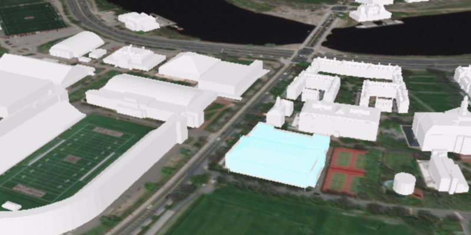

<h1>Scene Layer Select</h1>

This sample demonstrates how to select geoelements in a scene layer.

<h2>How to use the sample</h2>

Click on a building in the scene layer to select it. Unselect buildings by clicking away from the buildings.

<h2>How it works</h2>

To select geoelements in a scene layer:

<ol>
    <li>Create an <code>ArcGISSceneLayer</code> passing in the URL to a scene layer service.</li>
    <li>Use <code>sceneView.setOnMouseClicked</code> to get the screen click location <code>Point2D</code>.</li>
    <li>Call <code>sceneView.identifyLayersAsync(sceneLayer, point2D, tolerance, false, 1)</code> to identify features 
    in the scene.</li>
    <li>From the resulting <code>IdentifyLayerResult</code>, get the list of identified <code>GeoElement</code>s with
     <code>result.getElements()</code>.</li>
     <li>Get the first element in the list, checking that it is a feature, and call <code>sceneLayer.selectFeature
     (feature)</code> to select it.</li>
</ol>

<h2>Features</h2> 

<ul>
    <li>ArcGISSceneLayer</li>
    <li>IdentifyLayerResult</li>
</ul>