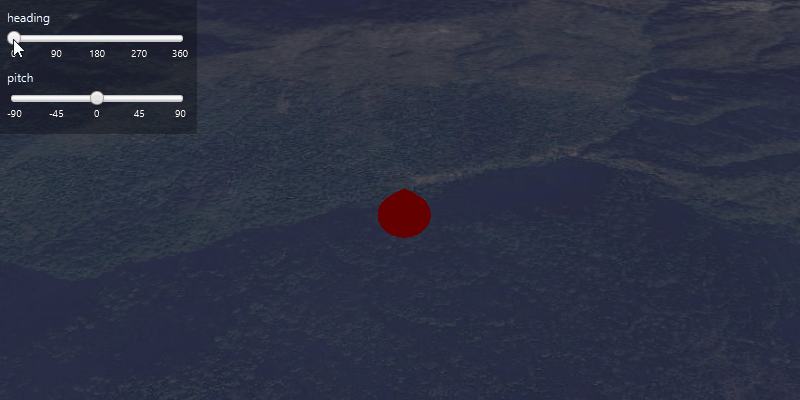

<h1>Scene Properties Expressions</h1>

Demonstrates how to update the orientation of a graphic using scene property rotation expressions.

<h2>How to use the sample</h2>

Move the heading and pitch sliders to change the cone's orientation.

<h2>How it works</h2>

To update a <code>Graphic</code>'s orientation using expressions:

<ol>
    <li>Create a new <code>GraphicsOverlay</code>.</li>
    <li>Create a <code>SimpleRenderer</code> and set expressions on its scene properties: <code>Renderer
    .getSceneProperties().setHeadingExpression("[HEADING]")</code>. Then set the renderer to the graphics overlay 
    with  <code>GraphicsOverlay.setRenderer(renderer)</code>.</li>
    <li>Create a graphic and add it to the graphics overlay.</li>
    <li>To update the graphic's rotation, use <code>Graphic.getAttributes.put("HEADING", heading)</code> where the attribute key is
        the expression and the value is the rotation angle.</li>
</ol>

<h2>Relevant API</h2>

<ul>
    <li>ArcGISScene</li>
    <li>Graphic</li>
    <li>GraphicsOverlay</li>
    <li>Renderer</li>
    <li>Renderer.SceneProperties</li>
    <li>SceneView</li>
    <li>Viewpoint</li>
</ul>

