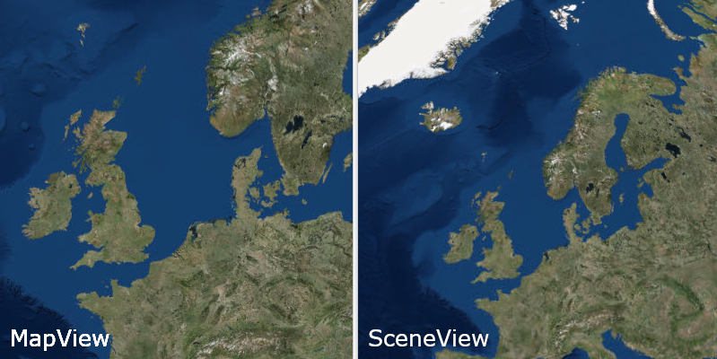

<h1>Sync map and scene viewpoints</h1>

Synchronize the view points between a <code>MapView</code> and a <code>SceneView</code>.

The two <code>GeoViews</code> share a common <code>ViewPoint</code>. When navigating in one view, the other view is immediately updated to display the same <code>ViewPoint</code>, resulting in a continuously updated and synchronized view.

<h2>How to use the sample</h2>

Interact with the map by panning, zooming or rotating the map or scene view. The other view will update automatically to match your navigation. Note that the resulting maps may not look identical due to the fact the <code>MapView</code> is 2D and the <code>SceneView</code> is 3D: but the centers and scales of each view will be kept the same.

<h2>How it works</h2>

<code>MapView</code> and <code>SceneView</code> inherit from the <code>GeoView</code> parent class. When the <code>GeoView</code>'s view point has changed, a listener can be added and allow the view point of the other <code>GeoView</code> to be set and synchronised.

<ol>
<li>Create a <code>MapView</code> and a <code>SceneView</code>.</li>
<li>Add a view point changed listener to each <code>GeoView</code> with <code>geoView.addViewpointChangedListener(viewpointChangedEvent)</code>.</li>
<li>Check if the <code>GeoView</code> is being navigated with <code>geoView.isNavigating()</code>.</li>
<li>Get the current view point of the active <code>GeoView</code> with <code>geoView.getcurrentViewpoint(Viewpoint.Type.CENTER_AND_SCALE)</code>.</li>
<li>Set the view point of the other view to the active view's view point with <code>geoView.setViewpoint(Viewpoint)</code>.</li>
</ol>

<h2>Relevant API</h2>

<ul>
<li>GeoView</li>

<li>CurrentViewpoint(Viewpoint.Type)</li>

<li>ViewpointChangedListener(viewpointChangedEvent)</li>

</ul>

<h2>Tags</h2>

2D, 3D, view synchronisation, Viewpoint, Scene, Map

