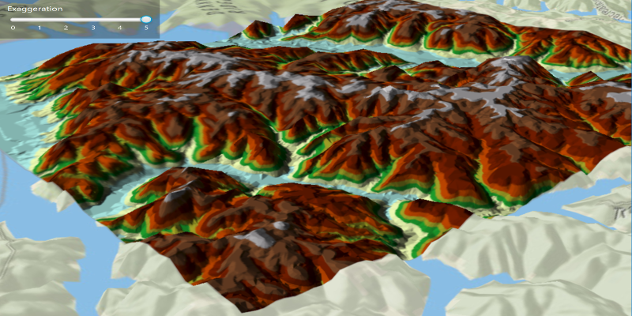

<h1>Terrain Exaggeration</h1>

Demonstrates how to add vertical exaggeration to a scene's surface.

<h2>How to use the sample</h2>

Selecting an exaggeration amount from the slider will apply that ammonut to the scene's surface.

<h2>How it works</h2>

To set exaggeration to a <code>Scene</code>'s <code>Surface</code>:

<ol>
  <li>Create an elevated surface and add it to the scene, <code>Surface.getElevationSources().add("Elevation URL")</code></li>
  <li>Add surface to the scene, <code> scene.setBaseSurface(Surface)</code></li>
  <li>Set exaggeration amount of the surface, <code>Surface.setElevationExaggeration(Exaggeration Amount)</code></li>
</ol>

<h2>Features</h2>

<ul>
  <li>ArcGISScene</li>
  <li>ArcGISSurface</li>
  <li>ArcGISTiledElevationSource</li>
</ul>
