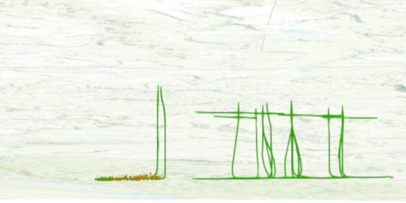

<h1>View content beneath terrain surface</h1>

See through terrain in a scene and move the camera underground.

<h2>Use case</h2>

By default, a scene's terrain is fully opaque and the camera cannot go underground. To see underground features such as pipes in a utility network, you can lower the opacity of the terrain surface and set the navigation constraint on the surface to allow underground navigation.

<h2>How it works</h2>

<ol>
<li>Display an <code>ArcGISScene</code> in a <code>SceneView</code> which contains layers with underground features.</li>

<li>To see underground, get the scene's base surface and set its opacity to a value between 0 and 1.</li>

<li>To allow the camera to go underground, set the surface's navigation constraint to <code>NONE</code>.</li>
</ol>

<h2>Relevant API</h2>

<ul>
<li>Surface</li>

<li>Surface.NavigationConstraint</li>
</ul>

<h2>About the data</h2>

This data is a point scene layer showing underground wellbore paths (green polylines) and seismic events (brown points).

<h2>Tags</h2>

3D, subsurface, underground, utilities
