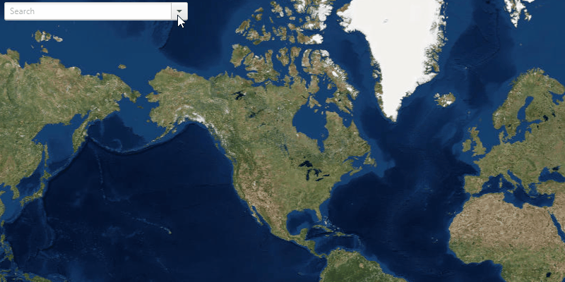

<h1>Find Address</h1>

Demonstrates how to geocode an address query and display its location on the map.

<h2>How to use the sample</h2>

For simplicity, the sample comes loaded with a set of addresses. You can select an address to perform online geocoding and show the matching results on the ArcGISMap.

<h2>How it works</h2>

To get a geocode from a query and display its location on the <code>ArcGISMap</code>:

<ol>
  <li>Create a <code>LocatorTask</code> using a URL.</li>
  <li>Set the <code>GeocodeParameters</code> for the locator task and specify the geocode's attributes.</li>
  <li>Get the matching results from the <code>GeocodeResult</code> using <code>LocatorTask.geocodeAsync(query, geocodeParameters)</code>.</li>
  <li>Show each result with a <code>Graphics</code> in a <code>GraphicsOverlay</code>, storing the attributes in 
  the graphic's attributes so they can later be shown in a callout.</li>
</ol>

<h2>Relevant API</h2>

<ul>
  <li>ArcGISMap</li>
  <li>GeocodeParameters</li>
  <li>GeocodeResult</li>
  <li>GraphicsOverlay</li>
  <li>LocatorTask</li>
  <li>MapView</li>
</ul>
