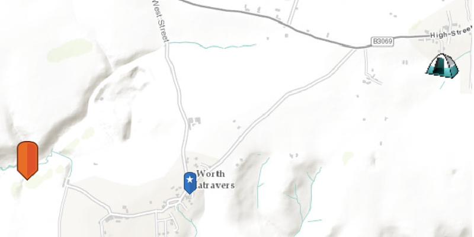

<h1>Picture Marker Symbol</h1>

Use pictures for markers.

<h2>How to use the sample</h2>

The picture marker symbols that you see in the app are all constructed from different types of resources
    - campsite,  constructed from a URL
    - blue pin with a star, stored in the resource folder that comes with the application
    - orange pin, created from a file path on disk (which is written to disk when the app starts and cleaned up when the app closes)

<h2>How it works</h2>

To display a <code>PictureMarkerSymbol</code>:

<ol>
    <li>Create the <code>ArcGISMap</code>'s with <code>Basemap</code>.</li>
    <li>Create the <code>GraphicsOverlay</code> and add it to the <code>MapView</code> using <code>MapView.getGraphicsOverlays().add()</code>.</li>
    <li>Add the map to the view, <code>MapView.setMap()</code>. </li>
    <li>Use the constructor <code>PictureMarkerSymbol(String uri)</code> to create a symbol from a specified URI (URL, a web page, or from an absolute path to a file that is stored locally).</li>
    <li>Use the constructor <code>PictureMarkerSymbol(Image)</code> to create a symbol from a local image. </li>
    <li>Lastly once a symbol is created it will need to be added to a <code>Graphic</code>. Set the graphic to the graphics overlay using the <code>GraphicsOverlay.getGraphics().add()</code> method indicating the location <code>Point</code>.</li>
</ol>

<h2>Relevant API</h2>

<ul>
    <li>ArcGISMap</li>
    <li>Graphic</li>
    <li>GraphicsOverlay</li>
    <li>MapView</li>
    <li>PictureMarkerSymbol</li>
    <li>Point</li>
</ul>

