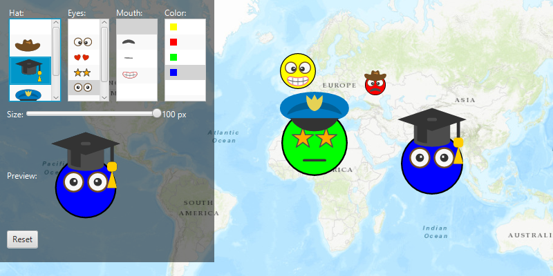

# Read symbols from a mobile style

Read symbols from a mobile style file and combine them to make customized symbology for geoelements.

## Use case

In many applications, geoelements are represented by a symbol composed of a number of components. For example, individual elements of a water infrastructure network, such as valves, nodes, or endpoints, will be represented on the map as symbols of the same base shape, with additional components or colors added to represent their unique characteristics, such as technical specifications. 

While each of these symbols can be created from scratch, a more convenient workflow is to author them using ArcGIS Pro and store them in a mobile style file (.stylx). ArcGIS Runtime can read symbols from a mobile style, and you can modify and combine them as needed in your app.

## How to use the sample

Select a symbol and a color from each of the category lists to create an emoji. A preview of the symbol is updated as selections are made. The size of the symbol can be set using the slider. Click the map to create a point graphic using the customized emoji symbol, and click "Reset" to clear all graphics from the display.

## How it works

1. Create a new `SymbolStyle` from a stylx file, and load it: `symbolStyle.loadAsync()`.
2. Get a set of default search parameters, `symbolStyle.getDefaultSearchParametersAsync()`, and use these to retrieve a list of all symbols within the style file: `symbolStyle.searchSymbolsAsync(defaultSearchParameters)`.
3. Iterate the list of `SymbolStyleSearchResult` and add symbols to list boxes according to their category. Display a preview of each symbol with `multilayerPointSymbol.createSwatchAsync()`.
4. When symbol selections change, create a new multilayer symbol by passing the keys for the selected symbols into `symbolStyle.emojiStyle.getSymbolAsync(symbolKeys)`. To only allow coloring in the emoji face, color lock all symbol layers except the base layer and update the current symbol preview image.
5. Create graphics symbolized with the current symbol when the user clicks on the map view.

## Relevant API

* MultilayerPointSymbol
* MultilayerSymbol.CreateSwatchAsync
* SymbolLayer
* SymbolStyle
* SymbolStyle.GetSymbolAsync
* SymbolStyleSearchParameters

## About the data

The mobile style file used in this sample was created using ArcGIS Pro, and is hosted on [ArcGIS Online](https://www.arcgis.com/home/item.html?id=1bd036f221f54a99abc9e46ff3511cbf). It contains symbol layers that can be combined to create emojis.

## Tags

advanced symbology, mobile style, multilayer, stylx