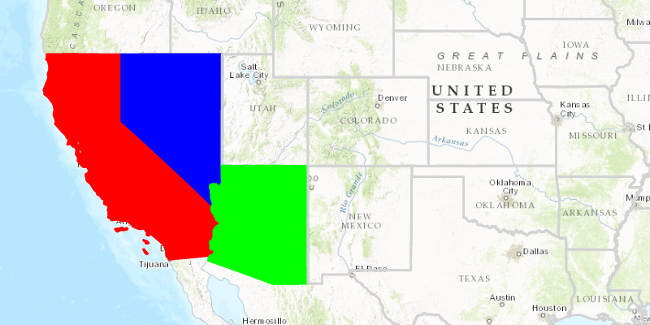

<h1>Unique Value Renderer</h1>

Demonstrates how to use an UniqueValueRenderer to display Features from a FeatureLayer using different symbols. An unique value renderer sets an attribute to look for any matches within it's unique values. If there is a match then the symbol assign to that unique value is use to display that feature with the same value.

In this sample the unique value renderer is looking for the "STATE_ABBR" attribute within each feature of the feature layer. For example we will have a unique value renderer that has a unique value set to the abbreviation for California.

<pre><code>
SimpleFillSymbol californiaFillSymbol = new SimpleFillSymbol(SimpleFillSymbol.Style.SOLID, RED,
new SimpleLineSymbol(SimpleLineSymbol.Style.SOLID, RED, 2));

List&lt;Object&gt; californiaValue = new ArrayList&lt;&gt;();
californiaValue.add("CA");
uniqueValueRenderer.getUniqueValues().add(new UniqueValue(State of California", "California",
californiaFillSymbol, californiaValue));
</code></pre>

When this unique value renderer comes across the feature whos key "STATE_ABBR" is value "CA" it will assign the symbol from the unique value above to this feature.

<h2>How to use the sample</h2>

Sample starts with a predefined UniqueValues for some US states which are set to the UniqueValueRenderer and applied to the FeatureLayer.

<h2>How it works</h2>

To display different <code>Symbol</code> for different <code>Graphic</code>s:

<ol>
    <li>Create a <code>ArcGISMap</code>'s with <code>Basemap</code>.</li>
    <li>Create a <code>FeatureLayer</code> and add it to the map, <code>ArcGISMap.getOperationalLayers().add()</code>.</li>
    <li>Add the map to the view, <code>MapView.setMap()</code>.  </li>
    <li>Create a <code>UniqueValueRenderer</code>.
        <ul><li>specify default feature attribute to look for, <code>UniqueValueRenderer.getFieldNames().add()</code></li>
            <li>set default symbol for renderer, <code>UniqueValueRenderer.setDefaultSymbol()</code></li>
            <li>set renderer to feature layer, <code>FeatureLayer.setRenderer(Renderer)</code></li></ul></li>
    <li>Create a set of <code>UniqueValue(Description, Name, Symbol, Value)</code>.
        <ul><li>description, description for this unique value</li>
             <li>name, name for this unique value</li>
            <li>symbol, symbol to be displayed for the values listed here</li>
            <li>value, list of values that will use the symbol set here (Example: List of state name abbreviations "CA")</li></ul></li>
    <li>Add unique values to renderer, <code>UniqueValueRenderer.getUniqueValues().add(UniqueValue)</code>. </li>
</ol>

<h2>Features</h2>

<ul>
    <li>ArcGISMap</li>
    <li>FeatureLayer</li>
    <li>MapView</li>
    <li>ServiceFeatureTable</li>
    <li>SimpleFillSymbol</li>
    <li>SimpleLineSymbol</li>
    <li>UniqueValues</li>
    <li>UniqueValueRenderer</li>
</ul>

