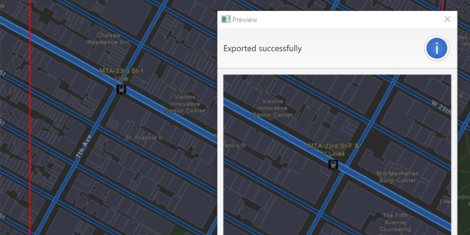

<h1>Export Vector Tiles</h1>

Demonstrates how to export vector tiles with its style from a vector tiled layer.

<h2>How to use the sample</h2>

First, a dialog will appear prompting for authentication credentials to arcgis.com. When the vector tiled layer 
loads, zoom in to the extent you want to export. The red box shows the extent that will be exported. Click the 
"Export Vector Tiles" button to start the job. A progress indicator will show. The larger the extent, the longer it 
will take to export. An error will show if the extent is larger than the maximum limit allowed. When finished, a 
dialog will show the exported result in a new map view.

<h2>How it works</h2>

To export tiles from an <code>ArcGISVectorTiledLayer</code>:

<ol>
  <li>Create an <code>ExportVectorTilesTask</code>, passing in the <code>PortalItem</code> for the vector tiled layer. 
  Since vector tiled layers are premium content, you must first authenticate with the Portal.</li>
  <li>Create default <code>ExportTilesParameters</code> with <code>task.createDefaultExportTilesParametersAsync(extent, maxScale)</code>.</li>
  <li>Call <code>task.exportVectorTilesAsync(defaultParams, vtpkPath, resourcePath)</code> to create the 
  <code>ExportVectorTilesJob</code>. The resource path is required if you want to export the tiles with the style.</li>
  <li>Call <code>job.start()</code> to start the export job.</li>
  <li>When the job is done, use <code>job.getResult()</code> to get the resulting 
  <code>ExportVectorTilesResult</code>.</li>
  <li>You can load the result as a <code>ArcGISVectorTiledLayer</code> with <code>new ArcGISVectorTiledLayer(result.getVectorTileCache(), result.getItemResourceCache())</code>.</li>
</ol>

<h2>Features</h2>

<ul>
  <li>ArcGISVectorTiledLayer</li>
  <li>ExportVectorTilesJob</li>
  <li>ExportVectorTilesParamters</li>
  <li>ExportVectorTilesResult</li>
  <li>ExportVectorTilesTask</li>
  <li>ItemResourceCache</li>
  <li>Portal</li>
  <li>PortalItem</li>
  <li>UserCredential</li>
  <li>VectorTileCache</li>
</ul>
