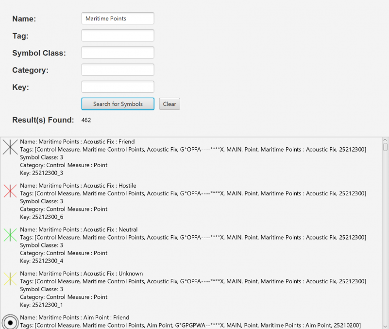

#Dictionary Symbol#
Demonstrates how to search for symbol primitives within a Symbol Dictionary using the mil2525d specification and display their symbol along with information.
There are five ways to search through a Symbol Dictionary:
- Name
- Tags
- Symbol Class
- Category
- Key

##How to use the sample##
By default, leaving the fields blank and hitting search will find all symbols.

To search for certain symbols:
  - enter text into one or multiple seach boxes and hit search for symbols
  - this will seach for symbols containing the information that was entered 

To search for multiple different symbols:
  - after entering your first search just repeat steps above
  - this will display any symbols that from all searches

Clear button:
  - will clear any previous search results and start fresh

##How it works##
How to search through a  `SymbolDictionary`:

1. Create a symbol dicitonary with the mil2525d specification, `SymbolDictionary("mil2525d")`
2. Load the dictionary asynchronouly, `DictionarySymbol.loadAsync()`
  - this will allows us to continue working while the dictionary loads all symbol primitives found within the mil2525d specification
3. Create search parameters for the dictionary, `StyleSymbolSearchParameters()`.
4. Set the parameters to search through the dictionary.
  - Name, `StyleSymbolSearchParameters.getNames().add()`
  - Tag, `StyleSymbolSearchParameters.getTags().add()`
  - Symbol Class, `StyleSymbolSearchParameters.getSymbolClasses().add()`
  - Category, `StyleSymbolSearchParameters.getCategories().add()`
  - Key, `StyleSymbolSearchParameters.getKeys().add()`
5.  Search through dictionary using parameters, `DictionarySymbol.searchSymbolsAsync(StyleSymbolSearchParameters)`.
6. Cycle through the `StyleSymbolSearchResult` list that was returned and display it to screen.
  - get `CimSymbol`,`StyleSymbolSearchResult.getSymbol()`, and create an image from it, `CimSymbol.createSwatchAsync()`
  - use other get methods for the symbol's name, tags, symbolClass, category, and key, like `StyleSymbolSearchResult.getName()`

##Features##
- CimSymbol
- StyleSymbolSearchParameters
- StyleSymbolSearchResult
- SymbolDictionary
