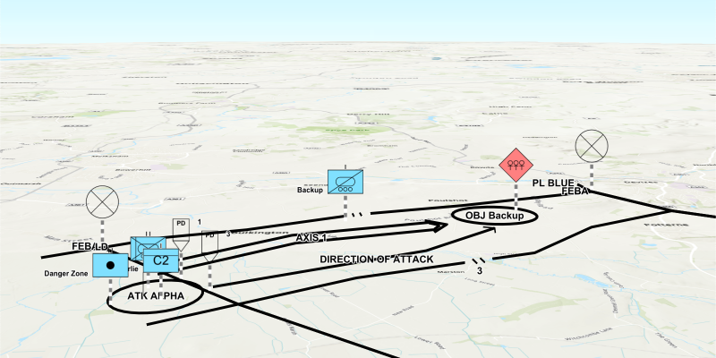

# Graphics Overlay Dictionary Renderer 3D

Display MIL-STD-2525. military symbology in 3D.

## Use case

Use a dictionary renderer on a graphics overlay to display more transient data, such as military messages coming through a local tactical network.

## How to use the sample

When launched, this sample displays a scene with a dictionary renderer. Pan and zoom to explore the scene.

## How it works

1. Create a `SymbolDictionary` from a dictionary (stylx) file.
2. Create a `DictionaryRenderer` with the symbol dictionary.
3. Set the renderer on a graphics overlay with `graphicsOverlay.setRenderer(dictionaryRenderer)`.
4. Parse an XML file conforming to the specification. It should have key-value pairs to use as attributes for each graphic:
    * Use the name of the XML node as the attribute key and the content of the node as the attribute value.
    * Get the WKID and coordinates from the XML to create the graphic's geometry.
5. The other attributes such as "symbolentity" and "symbolset" will describe the symbology for the graphic.
6. Create the graphic with the geometry and attributes and add it to the graphics overlay.

## Relevant API

* GraphicsOverlay
* DictionaryRenderer
* DictionarySymbolStyle

## Additional information

The dictionary renderer creates these graphics using a local mil2525d style file included in the SDK's resources/symbols directory plus an XML file with key-value attributes for each graphic.

## Tags

defense, military, situational awareness, tactical, visualization
