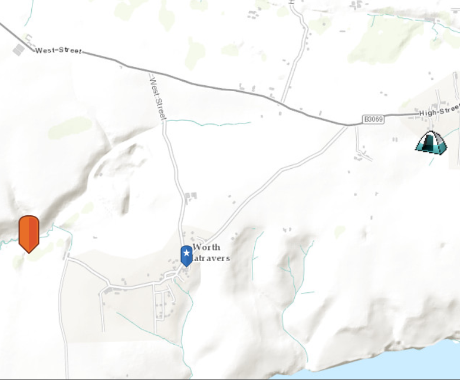

#Picture Marker Symbol#
Demonstrates how to create a PictureMarkerSymbol from different types of picture resources; an URL, locally on the device or in the app.

##How to use the sample##
The picture marker symbols that you see in the app are all constructed from different types of resources
  - campsite,  constructed from a URL
  - blue pin with a star, stored in the resource folder that comes with the application
  - orange pin, created from a file path on disk (which is written to disk when the app starts and cleaned up when the app closes)

##How it works##
 To display a `PictureMarkerSymbol`:

1. Create the `ArcGISMap`'s with `Basemap`.
2. Create the `GraphicsOverlay` and add it to the `MapView` using `MapView.getGraphicsOverlays().add()`.
3. Add the map to the view, `MapView.setMap()`. 
4. Use the constructor `PictureMarkerSymbol(String uri)` to create a symbol from a specified URI (URL, a web page, or from an absolute path to a file that is stored locally).
5. Use the constructor `PictureMarkerSymbol(Image)` to create a symbol from a local image. 
6. Lastly once a symbol is created it will need to be added to a `Graphic`. Set the graphic to the GraphicsOverlay using the `GraphicsOverlay.getGraphics().add()` method indicating the location `Point`.

##Features##
- ArcGISMap
- Graphic
- GraphicsOverlay
- MapView
- PictureMarkerSymbol
- Point
 
