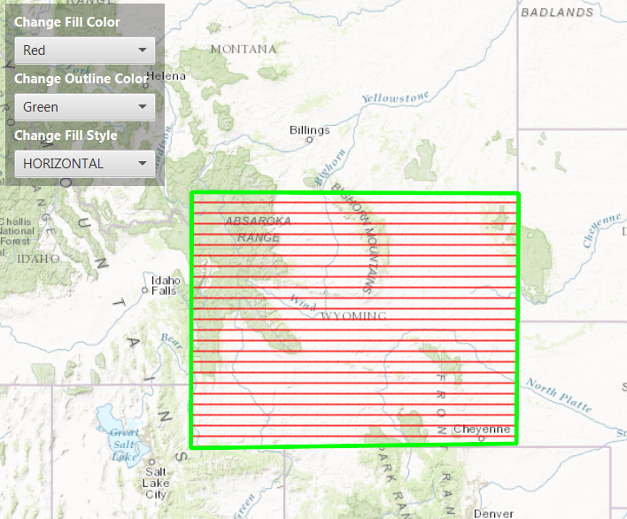

##Simple Fill Symbol##
This sample demonstrates how to change a `SimpleFillSymbol` colour, outline (LineSymbol), and style properties.

##How to use the sample##
For simplicity, the `Polygon` symbol colour is set as red without an outline. Use the sample dropdowns to add coloured outline and change the `PictureFillSymbol` colour and style.

##How it works##
 To show picture marker symbols in your app:

- Create the `ArcGISMap`'s basemap
- Create the GraphicsOverlay and add it to the `MapView` using `MapView#getGraphicsOverlays` method.
- Add the map to the view via `MapView` via `MapView#setMap()`. 
- Create a `Polygon` using `PointCollection` to indicate the `Graphic`'s geometry. 
- Create a `SimpleFillSymbol` to indicate your polygon geometry style, color and outline.
- Lately, create a `Graphic` via `Graphic(geometry, symbol)` method and add it to the `GraphicsOverlay`.
 
##Features##
- ArcGISMap
- MapView
- Graphic
- Polygon
- PointCollection
- GraphicsOverlay
- SimpleFillSymbol
