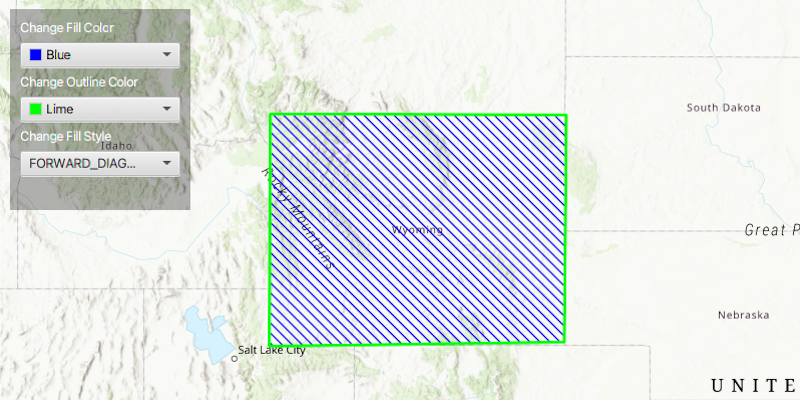

# Simple Fill Symbol

Change a graphic's fill color, outline, and style properties.

## How to use the sample

Change Fill color:
  - change the color that makes up the area of the polygon

Change Outline Color:
  - adds a border color to the polygon

Change Fill Style:
  - changes the pattern that makes up the area of the polygon

## How it works

To create a `SimpleFillSymbol`:

  1. Create the `ArcGISMap`'s with `Basemap`.
  2. Create the `GraphicsOverlay` and add it to the `MapView`, `MapView.getGraphicsOverlays().add()`.
  3. Add the map to the `MapView`, `MapView.setMap()`.
  4. Create a `Polygon` using a `PointCollection` to indicate the boundaries of the `Graphic`.
  5. Create a `SimpleFillSymbol(SimpleMarkerSymbol.Style, color, outline)`.
*   style, pattern that makes up the area of the geometry
*   color, color the symbol will be displayed
*   outline, `SimpleLineSymbol` that make up the border of the symbol
  6. Lately, create a `Graphic(Geometry, Symbol)` and add it to the graphics overlay.

## Relevant API

*   ArcGISMap
*   Graphic
*   GraphicsOverlay
*   MapView
*   Polygon
*   PointCollection
*   SimpleFillSymbol
*   SimpleFillSymbol.Style
*   SimpleLineSymbol

