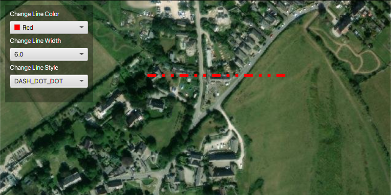

<h1>Simple Line Symbol</h1>

Change a line graphic's color and style.

<h2>How to use the sample</h2>

Change Line Color:
  - changes the color of the line symbol

Change Line Width:
  - change the width of the line symbol

Change Line Style:
  - changes the pattern of the line symbol

<h2>How it works</h2>

To display a <code>SimpleLineSymbol</code>:

<ol>
  <li>Create a <code>ArcGISMap</code>'s with <code>Basemap</code>.</li>
  <li>Create a <code>GraphicsOverlay</code> and add it to the <code>MapView</code>, <code>MapView.getGraphicsOverlays().add()</code>.</li>
  <li>Add the map to the view, <code>MapView.setMap()</code>. </li>
  <li>Create a <code>Polyline</code> using a <code>PointCollection</code> to indicate the boundaries of the <code>Graphic</code>. </li>
  <li>Create a <code>SimpleLineSymbol(SimpleLineSymbol.Style, color, width)</code>.
    <ul><li>style, pattern that makes up this symbol</li>
      <li>color, color to display this symbol as</li>
      <li>width, size of this symbol</li></ul></li>
  <li>Lately, create a <code>Graphic(Geometry, Symbol)</code> and add it to the graphics overlay.</li>
</ol>

<h2>Relevant API</h2>

<ul>
  <li>ArcGISMap</li>
  <li>Graphic</li>
  <li>GraphicsOverlay</li>
  <li>MapView</li>
  <li>Polyline</li>
  <li>PointCollection</li>
  <li>SimpleLineSymbol</li>
  <li>SimpleLineSymbol.Style</li>
</ul>
