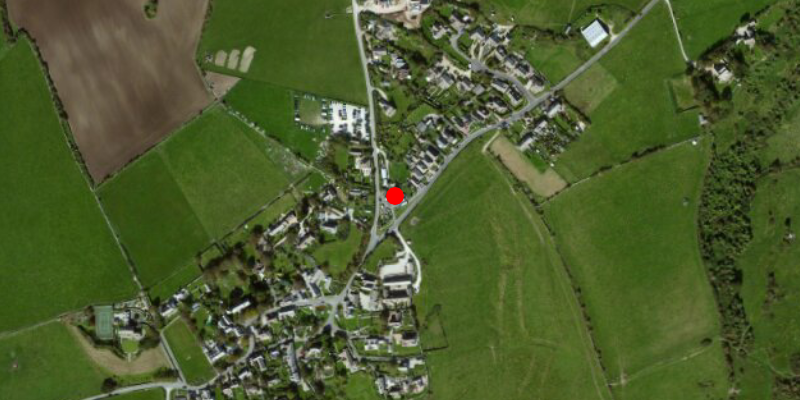

##Simple Marker Symbol##
This sample demonstrates how to add a `SimpleMarkerSymbol` to your `ArcGISMap`.

##How to use the sample##
For simplicity, the sample starts with a predefined `SimpleMarkerSymbol` geometry.

##How it works##
 To show picture marker symbols in your app:

- Create the `ArcGISMap`'s basemap
- Create the GraphicsOverlay and add it to the `MapView` using `MapView#getGraphicsOverlays` method.
- Add the map to the view via `MapView` via `MapView#setMap()`.  
- Create a symbol via `SimpleMarkerSymbol` indicating the style, colour and size. 
- Lately, create a `Graphic` via `Graphic(point, symbol)` method and add it to the `GraphicsOverlay`.
 
##Features##
- ArcGISMap
- MapView
- Graphic
- Point
- GraphicsOverlay
- SimpleMarkerSymbol
