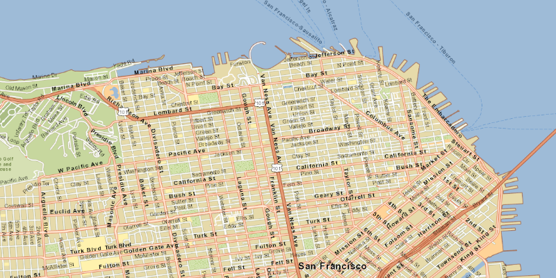

# Tile cache

Create a basemap from a local tile cache.

## Use case

An `ArcGISTiledLayer` consumes raster tiles provided by an ArcGIS service or a tile package (.tpk & .tpkx). Dividing a raster into tiles allows the map to provide relevant tiles and level of detail to the user when panning and zooming.

## How it works

1. Create a `TileCache`, specifying the path to the local tile package.
2. Create a `ArcGISTiledLayer` with the tile cache.
3. Create a `Basemap` with the tiled layer.
4. Create a `ArcGISMap` with the basemap and set it to a `MapView`.

## Relevant API

* ArcGISMap
* ArcGISTiledLayer
* TileCache

## Additional information

`ArcGISTiledLayer` supports both .tpk and .tpkx file formats.

## Tags

layers, tile, TileCache, ArcGISTiledLayer
