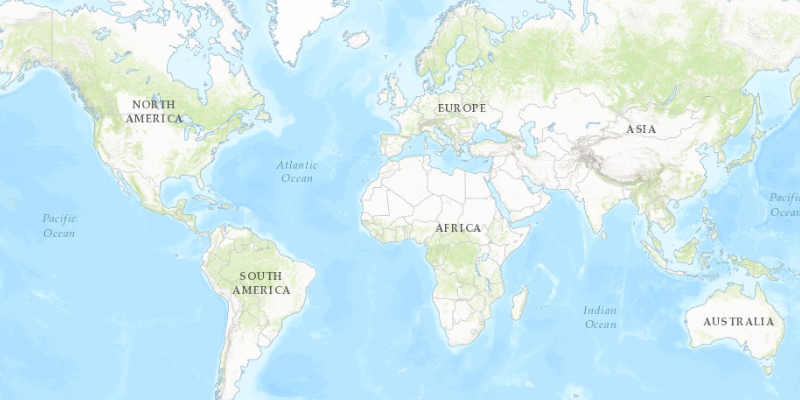

# Tiled layer

Display tiles from an ArcGIS tile service.

## Use case

An `ArcGISTiledLayer` consumes raster tiles provided by an ArcGIS service or a tile package (.tpk & .tpkx). Dividing a raster into tiles allows the map to provide relevant tiles and level of detail to the user when panning and zooming, allowing for rapid map visualization and navigation. The service in this sample pre-generates images based on a tiling scheme.

## How it works

1.  Create an `ArcGISTiledLayer` object from a URL.
2.  Pass the tiled layer in to a new `Basemap`.
3.  Set the basemap to an `ArcGISMap`.

## Relevant API

*   ArcGISMap
*   ArcGISTiledLayer
*   MapView

## Additional information

An `ArcGISTiledLayer` can also be added to the ArcGISMap as a layer, but it's best practice to use as a basemap since its purpose is to provide geographical context. Tiled Layer supports both .tpk and .tpkx file formats.

## Tags

layers, tile, ArcGISTiledLayer
