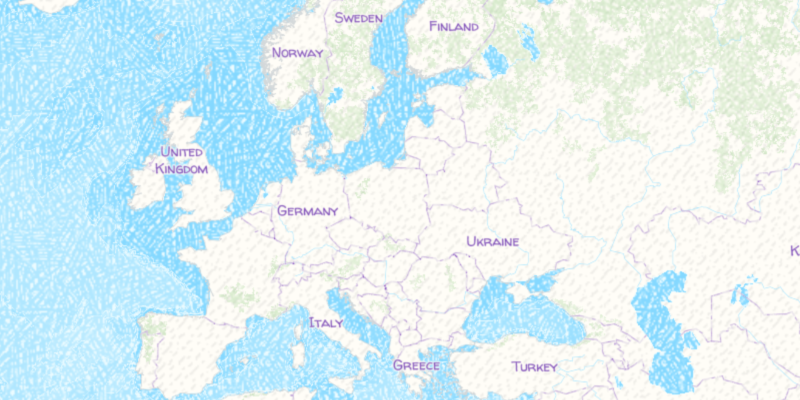

# Vector Tiled Layer URL

Display tiles from an ArcGIS vector tile service.

## How it works

To add an `ArcGISTiledLayer` as a `Basemap` to an `ArcGISMap`:

  1. Create an ArcGISVectorTiledLayer from a URL with `new ArcGISVectorTiledLayer(url)`.
  2. Create a basemap passing in the vector tiled layer.
  3. Set the basemap to the map with `map.setBasemap(basemap)`.

## Relevant API

  * ArcGISMap
  * ArcGISVectorTiledLayer
  * Basemap
  * MapView

