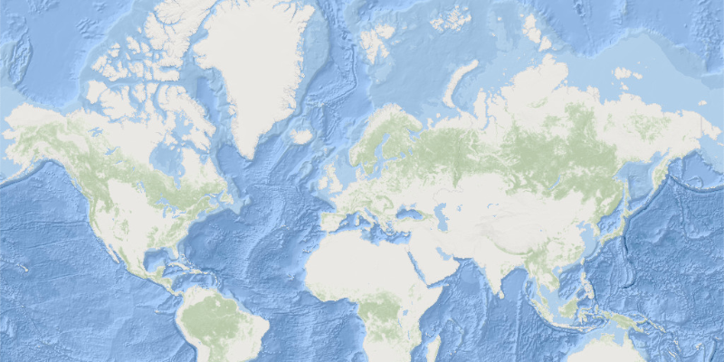

# Web Tiled Layer

Display map tiles from any custom (non-ArcGIS) service.

WebTiledLayer provides a simple way to integrate non-ArcGIS Services as a layer in a map. In this case, map tiles
from Stamen are added to the map. The template URI is specified by setting the subDomains, level, column, and row
attributes. Additionally, copyright information is added to the layer so that the layer can be properly attributed.

## How it works

To create and display a `WebTiledLayer` with custom attribution:

  1. Create a `WebTiledLayer` specifying the list of subdomains and a template URI.
  2. After loading the layer, use `webTiledLayer.setAttribution(attributionText)` to set custom
  attribution.

## Relevant API

  * ArcGISMap
  * Basemap
  * MapView
  * WebTiledLayer

