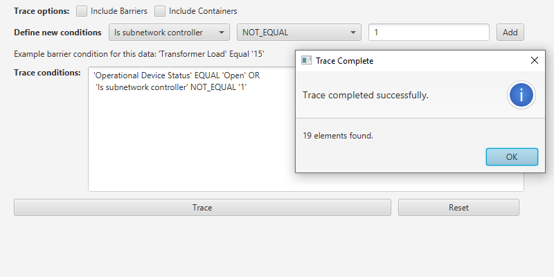

# Configure subnetwork trace

Get a server-defined trace configuration for a given tier and modify its traversability scope, add new condition barriers and control what is included in the subnetwork trace result.

## Use case

While some traces are built from an ad-hoc group of parameters, many are based on a variation of the trace configuration taken from the subnetwork definition. For example, an electrical trace will be based on the trace configuration of the subnetwork, but may add additional clauses to constrain the trace along a single phase. Similarly, a trace in a gas or electric design application may include features with a status of "In Design" that are normally excluded from trace results.

## How to use the sample

The sample loads with a server-defined trace configuration from a tier. Check or uncheck which options to include in the trace - such as containers or barriers. Use the selection boxes to define a new condition network attribute comparison, and then use 'Add' to add it to the trace configuration. Click 'Trace' to run a subnetwork trace with this modified configuration from a default starting location.

Example barrier conditions for the default dataset:

* 'Transformer Load' Equal '15'
* 'Phases Current' DoesNotIncludeTheValues 'A'
* 'Generation KW' LessThan '50'

## How it works

1. Populate the choice list for the comparison source with the non-system defined `utilityNetwork.getDefinition().getNetworkAttributes()`. Populate the choice list for the comparison operator with the enum values from `UtilityAttributeComparisonOperator`.
2. Create and load a `UtilityNetwork` with a feature service URL, then get an asset type and a tier by their names.
3. Create a `UtilityElement` from this asset type to use as the starting location for the trace.
4. Update the selected barrier expression and the checked options in the UI using this tier's `UtilityTraceConfiguration`.
5. When a 'Network Attribute' comparison source is selected, populate the choice list for the comparison value with its `CodedValue`s. Otherwise, display a free-form textbox for entering an attribute value.
6. When the 'Add' button is clicked from the UI, create a new `UtilityNetworkAttributeComparison` using the selected comparison source, operator, and selected or typed value. Use the selected source's `UtilityNetworkAttribute.DataType` to convert the comparison value to the correct data type.
7. If the Traversability's list of `Barriers` is not empty, create a `UtilityTraceOrCondition` with the existing `Barriers` and the new comparison from step 7.
8. When the 'Trace' button is clicked, create `UtilityTraceParameters` passing in `UtilityTraceType.SUBNETWORK` for the trace type and the default starting location. Set its `UtilityTraceConfiguration` with the modified options, selections, and expression; then run a `UtilityNetwork.traceAsync()`.
9. Display the count of elements returned within the `UtilityElementTraceResult`.
10. When the 'Reset' button is clicked, set the trace configurations expression back to its original value.

## Relevant API

* CodedValueDomain
* UtilityAssetGroup
* UtilityAssetType
* UtilityAttributeComparisonOperator
* UtilityCategory
* UtilityCategoryComparison
* UtilityCategoryComparisonOperator
* UtilityDomainNetwork
* UtilityElement
* UtilityElementTraceResult
* UtilityNetwork
* UtilityNetworkAttribute
* UtilityNetworkAttributeComparison
* UtilityNetworkDefinition
* UtilityNetworkSource
* UtilityTerminal
* UtilityTier
* UtilityTraceAndCondition
* UtilityTraceConditionalExpression
* UtilityTraceConfiguration
* UtilityTraceOrCondition
* UtilityTraceParameters
* UtilityTraceResult
* UtilityTraceType
* UtilityTraversability
* UtilityTraversabilityScope

## About the data

The [feature service](https://sampleserver7.arcgisonline.com/arcgis/rest/services/UtilityNetwork/NapervilleElectric/FeatureServer) in this sample represents an electric network in Naperville, Illinois, which contains a utility network used to run the subnetwork-based trace.

## Tags

category comparison, condition barriers, network analysis, network attribute comparison, trace configuration, traversability, utility network, validate consistency, subnetwork trace
